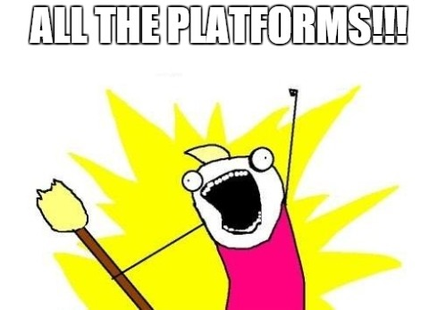
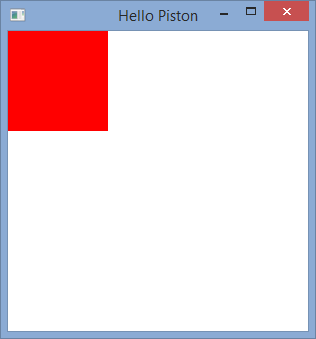

# Writing Cross-Platform Games in Rust Using Piston

So you want to make a kick-ass game, right? You want said game to work on Windows, Mac, and Linux, right!? Well, dear reader, you have come to the right place!

The first step to game development is not a kick-ass idea, though. The first step is actually much more exciting: picking your *tools*, and *learning them well*. By choosing this tutorial, you have chosen Rust as your language and Piston as your game engine, and those are some mighty fine choices! Rust is easily installed in minutes with a one-liner on Windows, Mac, and Linux, and this tutorial will show you that Piston is quick and easy to set up. Let's get started.

## Prerequisites

Here are the things you'll need to follow this tutorial:

- A text editor
- A working installation of `git`
- A working internet connection

## Installing Rust

Rust has a fabulous introductory book that you can read online, [and you can find the section on installing Rust here](http://doc.rust-lang.org/book/installing-rust.html "Hurry and click it!").

## Getting Started with Piston

Piston is going to require a few more steps to set up than Rust did, but it's hard to compete with one-liners. We'll need to:

- Install the SDL2 and FreeType development libraries
- Create a basic Piston project

Sounds easy, right? Great! It is.

### Set Up the Sample Project

Clone this repository! Put it wherever you want, and make sure it's easy to get back to.

    git clone https://github.com/tedsta/piston-cross-platform-tutorial.git

That's all. From now on, `$TUTORIAL_ROOT` refers to cloned repository's location.

### Installing SDL2 and FreeType on Windows

Unfortunately, Windows is the toughest platform to develop on. The Windows version of Rust comes bundled with a minimal MinGW inside. Because there are so many versions of MinGW (tdm vs sjlj, w32 vs w64), and because the compiler used to link the development libraries must match the compiler used to link your final application, producing the correct \*.a and \*.dll files is extremely frustrating on Windows.

Luckily for you crazy kids, C has a stable ABI, so you can simply plug in the binaries I have produced!

Copy the \*.a files in the `$TUTORIAL_ROOT/windows_clibs` folder to `$RUST_ROOT\bin\rustlib\x86_64-pc-windows-gnu\lib`, which is most likely `C:\Rust\bin\rustlib\x86_64-pc-windows-gnu\lib` on your machine.

Copy the \*.dll files in `$TUTORIAL_ROOT/windows_clibs` to `$TUTORIAL_ROOT/sample_project`.

### Installing SDL2 and FreeType on Linux

Install the SDL2 and FreeType libraries from your distro's package manager.

On Ubuntu, do this:

    sudo apt-get install libsdl2-dev libfreetype6-dev

If you can't get the libraries from your package manager, you can build them from source by following the guide below.

### Installing SDL2 and FreeType on Mac OSX

If you have [Homebrew](http://brew.sh/ "Homebrew") installed, SDL2 is easy.

    brew install sdl2

If you don't have Homebrew installed, don't worry about it. You can install the libraries from source below.

### Installing SDL2 and FreeType From Source

If you already installed SDL2 and FreeType using one of the methods above, skip this section.

Download these files and put them somewhere you'll be comfortable working with them:

- [SDL2](https://www.libsdl.org/release/SDL2-2.0.3.tar.gz "SDL2")
- [FreeType](http://download.savannah.gnu.org/releases/freetype/freetype-2.5.5.tar.gz "FreeType")

In a terminal, `cd` to the directory you downloaded SDL2 and FreeType to. Next, extract the files:

    tar -xzvf SDL2-2.0.3.tar.gz; rm SDL2-2.0.3.tar.gz
    tar -xzvf freetype-2.5.5.tar.gz; rm freetype-2.5.5.tar.gz

Build and install SDL2:

    cd SDL2-2.0.3; ./configure; make; make install; cd ..
    cd freetype-2.5.5; ./configure; make; make install; cd ..

Annnd you're done!

## Running the Sample Project

If you've made it this far, congratulations! The hardest stuff is over, and we're finally going to build some code and watch it run.

`cd` to the `$TUTORIAL_ROOT/sample_project` directory in `command prompt` if you are running Windows or `terminal` if you are running Linux or Mac OSX.

Build the sample project using `Cargo`, Rust's excellent package manager:

    cargo build

Run the sample project:

    cargo run

You should get a screen that looks like this:

## Continuing the Game Development Quest

Congratulations! You're all set up with Rust and Piston! Hopefully there will be more time to create more tutorials, but for now you'll have to continue your journey elsewhere:

- Check out the source code: `$TUTORIAL_ROOT/sample_project/src/main.rs`
- [Read the Rust book](http://doc.rust-lang.org/book/ "Go read it!")
- [Check out the Piston examples](https://github.com/PistonDevelopers/piston-examples "Go check them out!")